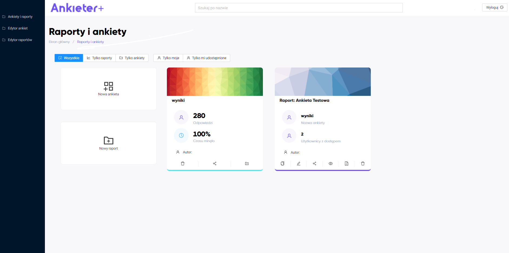
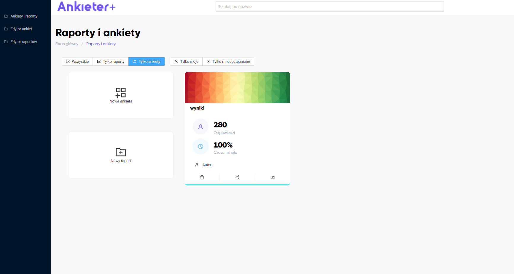
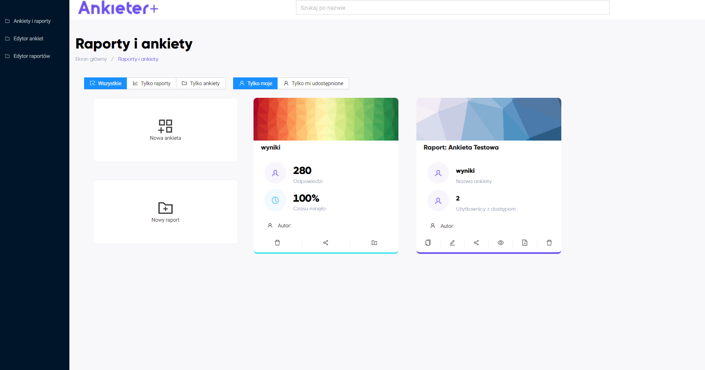
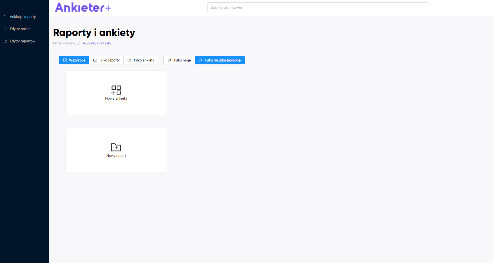
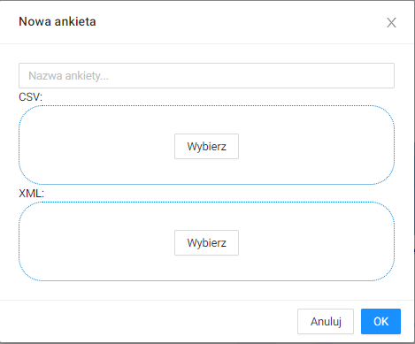

# Dla użytkownika

##Opis interfejsu

##Panel główny

W panelu głównym wyświetlają się ankiety oraz raporty, które są utworzone przez użytkownika lub, do których użytkownik ma uprawnienia.

Można zawęzić wydok tylko do ankiet lub raportów.

MOżna wyświetlić te ankiety/raporty, które są utworzone przez użytkownika. 

Albo takie, które są udostępnione. W poniższym przykładzie użytkownik nie ma usostępnionej ankiety raportu.

##Edytor ankiet

###Dodawanie wyników z ankiety

1. W panelu głównym należy kliknąć  `Nowa ankieta`.  
   
2. Wyświetli się okno:  
   
3. W oknie należy podać nazwę nowej ankiety, umieścić plik `.csv` z wynikami ankiety oraz plik `.xml` ze strukturą ankiety.  
   
4. Należy kliknąć przycisk `OK`. Wyniki ankiety zostały dodane i wyświetlają się teraz w panelu głównym.  
   

##Edytor raportów

###Utworzenie raportu z ankiety

##Udostępnianie (imienne, grupami, linkami)

##Artykuł: Jak przeprowadzić ankietę i analizę?

##Artykuł: Jak dodać własne dane lub projekt ankiety?