# Opis interfejsu

# Panel główny

Po zalogowaniu, w panelu głównym wyświetlają się ankiety oraz raporty, które są utworzone przez użytkownika lub, do których użytkownik ma uprawnienia.

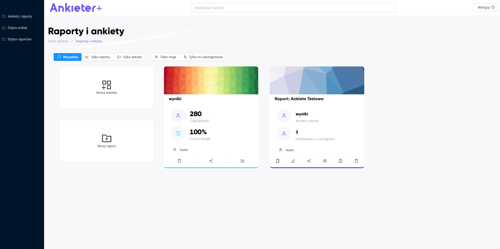

Można zawęzić widok do ankiet lub raportów.

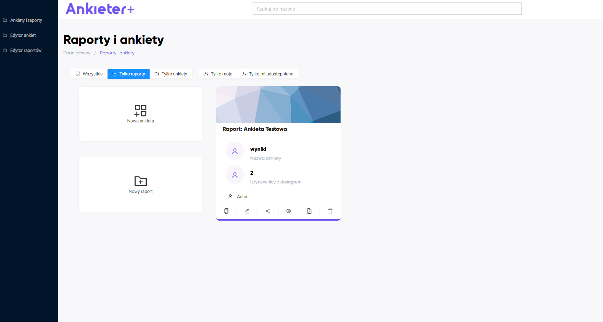

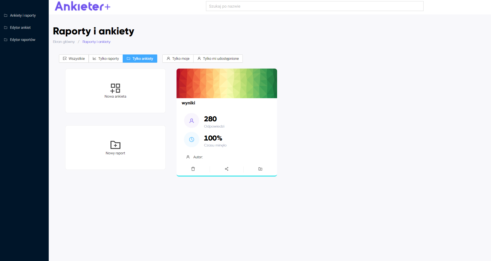

Można wyświetlić te ankiety/raporty, które są utworzone przez użytkownika.

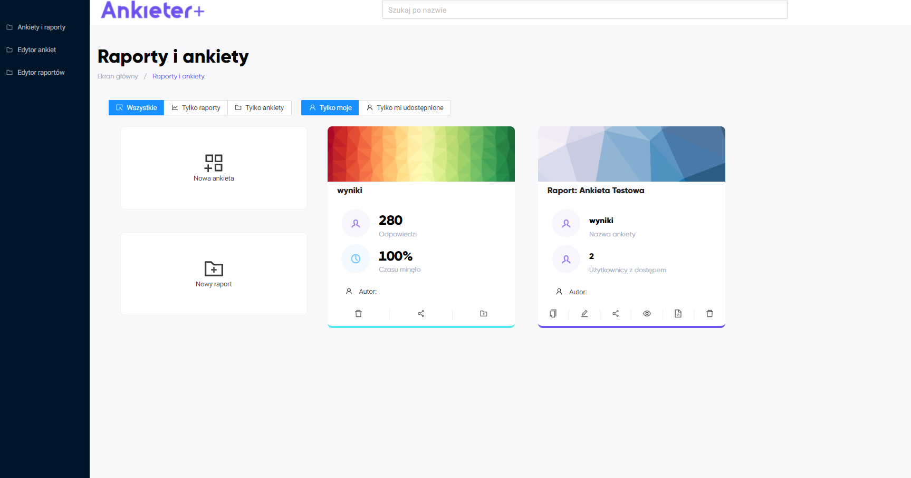

Albo takie, które są użytkownikowi udostępnione.

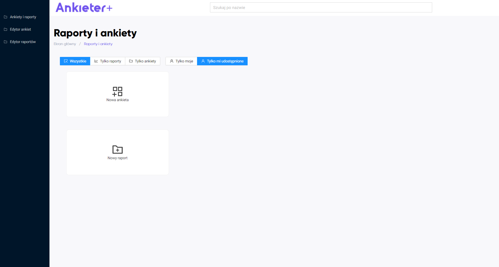

## Edytor ankiet

Edytor ankiet służy do wygenerowaniu ankiety w formacie xml.

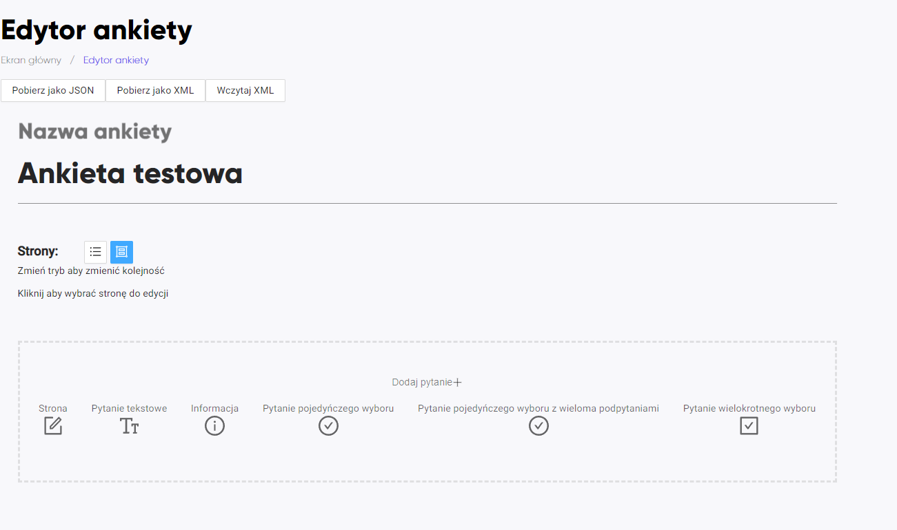

### Strona
Umożliwia wyświetlenie pytań na jednej stronie.

#### Informacja
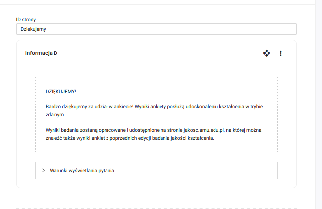

### Typy pytań dostępne w edytorze

#### Pytanie pojedyńczego wyboru
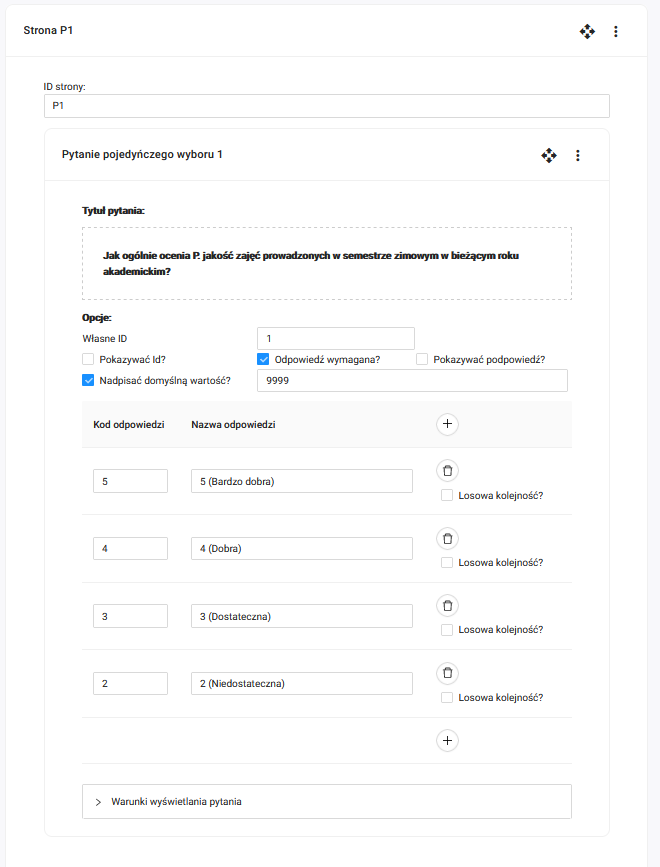

#### Pytanie tekstowe
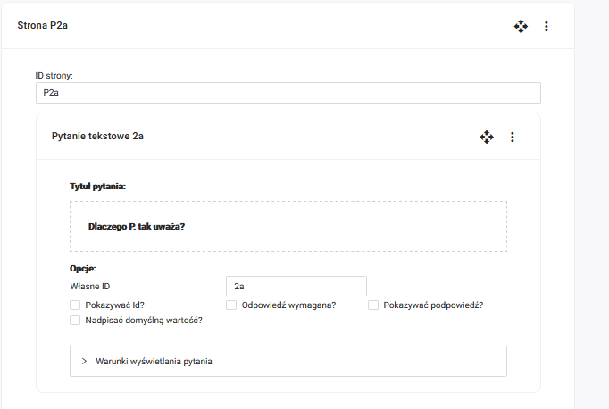

#### Pytanie pojedynczego wyboru z wieloma podpytaniami
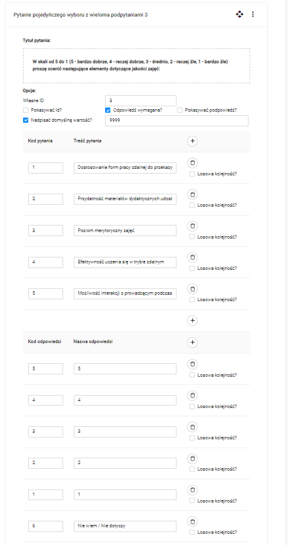

#### Pytanie wielokrotnego wyboru
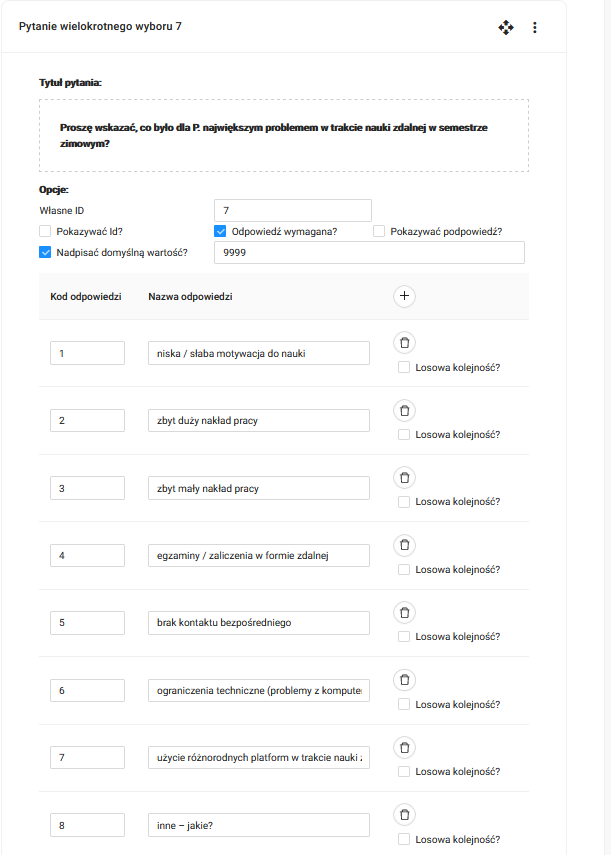

Dodatkowo można określić warunki wyświetlenia pytania.
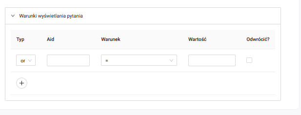

## Dodawanie wyników z ankiety

W panelu głównym należy kliknąć  `Nowa ankieta`.  

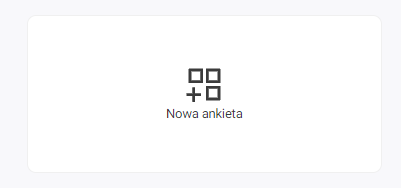

Wyświetli się okno:  

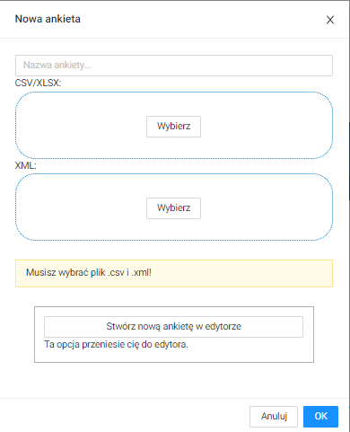

W oknie należy podać nazwę nowej ankiety, umieścić plik `.csv` z wynikami ankiety oraz plik `.xml` ze strukturą ankiety.  

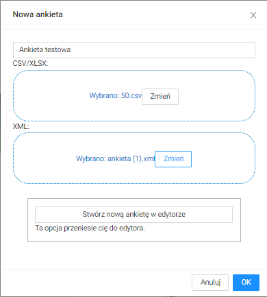

Należy kliknąć przycisk `OK`. Wyniki ankiety zostaną dodane i wyświetlą się w panelu głównym.  

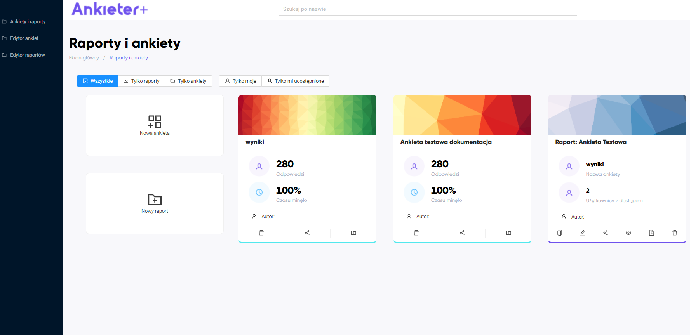

## Edytor raportów

Raport umożliwia dodanie pól tekstowych oraz wykresów. Pola można przestawiać.

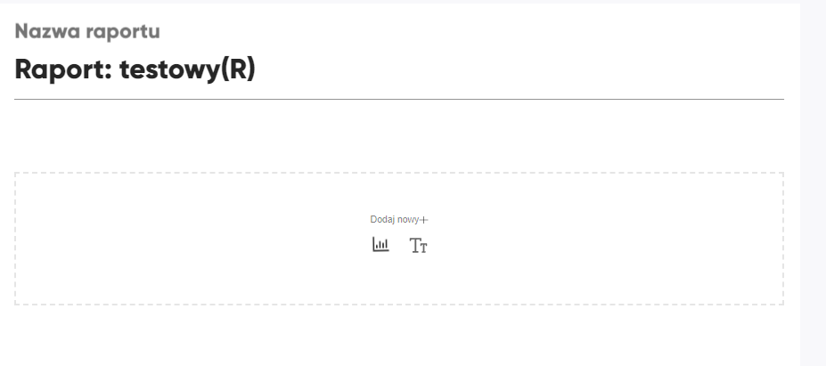

Dodanie elementu tekstowego

Dodanie wykresu
Można wybrać typ wykresu

Dalej wskazuje się pytanie będące źródłem danych oraz pytanie, po którym będą filtrowane odpowiedzi.

Wygenerowany wykres

Dodatkowo istnieje możliwość nadpisania etykiety dla całego raportu oraz filtrowanie ankiety przez odpowiedź.
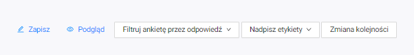

