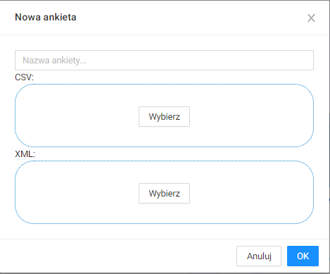
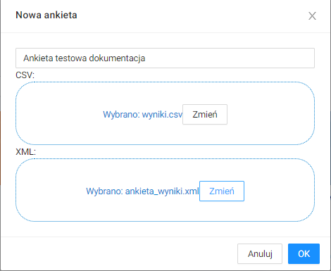

# Opis interfejsu

# Panel główny

Po zalogowaniu, w panelu głównym wyświetlają się ankiety oraz raporty, które są utworzone przez użytkownika lub, do których użytkownik ma uprawnienia.

Można zawęzić widok do ankiet lub raportów.

Można wyświetlić te ankiety/raporty, które są utworzone przez użytkownika.

Albo takie, które są użytkownikowi udostępnione.

# Edytor ankiet

## Dodawanie wyników z ankiety

W panelu głównym należy kliknąć  `Nowa ankieta`.  

Wyświetli się okno:  

W oknie należy podać nazwę nowej ankiety, umieścić plik `.csv` z wynikami ankiety oraz plik `.xml` ze strukturą ankiety.  

Należy kliknąć przycisk `OK`. Wyniki ankiety zostaną dodane i wyświetlą się w panelu głównym.  

